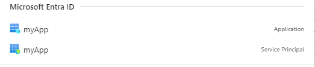
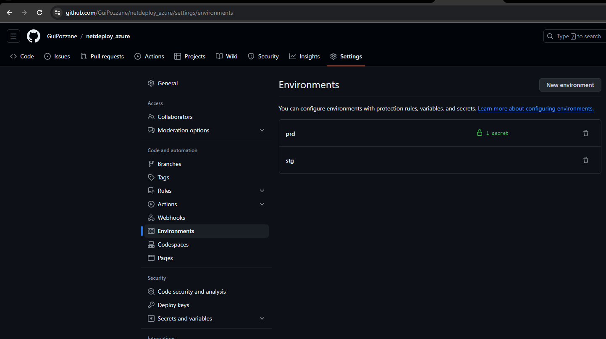

# Getting a Deep Understanding of GitHub Workflows

## Overview
This guide will walk you through the steps needed to deploy your application using GitHub workflows and Azure. 

## Prerequisites
1. An active Azure subscription. [Sign up for a free trial here](https://azure.microsoft.com/en-us/free/).
2. Azure CLI installed on your machine. [Follow these instructions](https://learn.microsoft.com/en-us/cli/azure/install-azure-cli-windows?tabs=azure-cli).

## Steps

### 1. Install Azure CLI
   - Follow the instructions on the [official Microsoft documentation](https://learn.microsoft.com/en-us/cli/azure/install-azure-cli-windows?tabs=azure-cli).

### 2. Login to Azure
   - Open your command prompt and run:
     ```sh
     az login --use-device-code
     ```

### 3. Select Your Subscription
   - Use the following command to set your subscription:
     ```sh
     az account set --subscription <name-or-id>
     ```

### 4. Create a Service Principal
   - Run the following command to create a service principal (replace `{subscription-id}` with your actual subscription ID):
     ```sh
     az ad sp create-for-rbac --name "myApp" --role owner --scopes /subscriptions/{subscription-id} --json-auth
     ```
   - This will give full access to the subscription. For best practices, consider using [RBAC roles](https://learn.microsoft.com/en-us/azure/role-based-access-control/built-in-roles) and learn more about [RBAC](https://learn.microsoft.com/en-us/azure/role-based-access-control/overview).

### 5. Store Credentials
   - You will receive a JSON response similar to this:
     ```json
     {
         "clientId": "<GUID>",
         "clientSecret": "<secret>",
         "subscriptionId": "<GUID>",
         "tenantId": "<GUID>"
     }
     ```
   - You can search for `myApp` in your Azure portal to verify the service principal.



### 6. Configure GitHub
   - Go to your GitHub repository settings and create an environment.
   - Inside the environment, create a new secret called `azurecrendentials` and paste the JSON response.



### 7. Create Deployment Script
   - Now, your infrastructure to deploy in Azure is ready. You just need to create your script to deploy everything inside Azure.

## References
- [Installing Azure CLI](https://learn.microsoft.com/en-us/cli/azure/install-azure-cli-windows?tabs=azure-cli)
- [Creating an Azure Service Principal](https://learn.microsoft.com/en-us/cli/azure/azure-cli-sp-tutorial-1?tabs=bash)
- [Connecting from Azure to GitHub](https://learn.microsoft.com/en-us/azure/developer/github/connect-from-azure?tabs=azure-portal%2Clinux)
